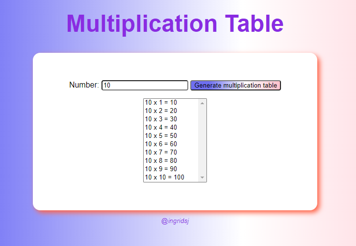

# multiplication-table
 A multiplication table. Exercise proposed by "Curso em Vídeo" in the JavaScript and ECMAScript course for beginners.

 
 
 First experience with JavaScript, using the if statement, loops and function invoked by an "onclick".
